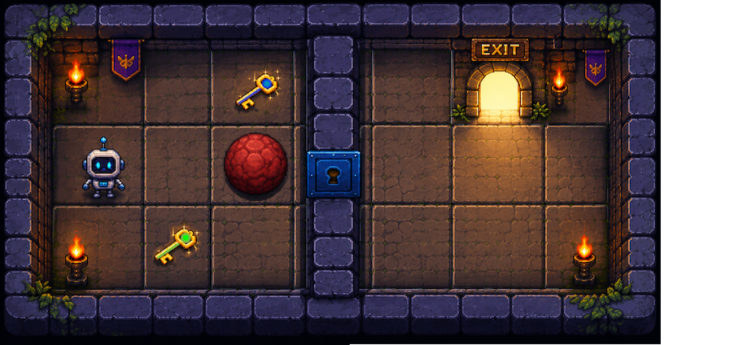
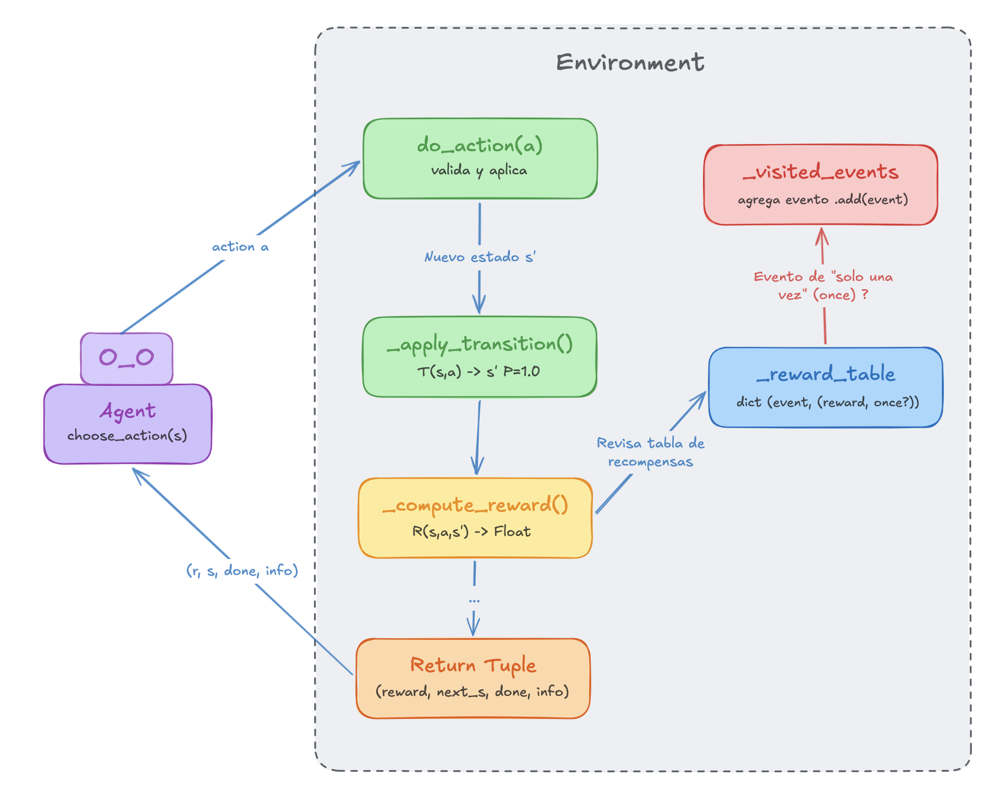
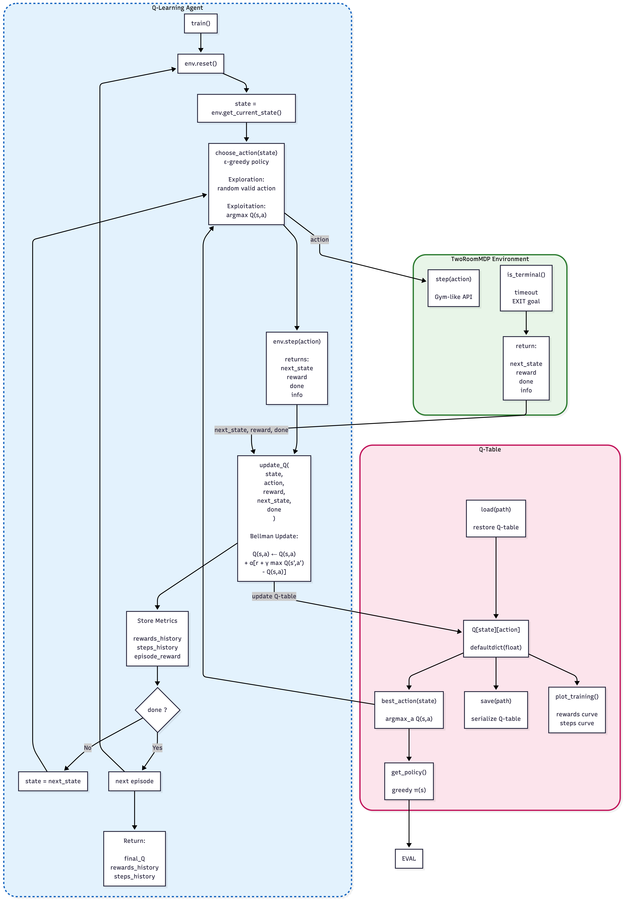

# ReinforcementLearningQLearningTwoGridworldAgent
A Reinforcement Learning Agent Solving A Two-Room Gridworld Challenge Using Q-Learning And Adopting An Objective-Oriented RL Reward Design, Pedro Trujillo V. (pe.trujillo@uniandes.edu.co) Reinforcement Learning


# Environment Description




<!-- <br> -->
<!-- <center> -->
<!--      -->
<!--      -->

<!-- </center> -->

The environment consists of **two rooms** separated by a vertical wall (a `#` barrier) featuring a locked door in the middle. The agent spawns in the **left** room, and its objective is to reach the exit square in the **right** room (the position of which is unknown to the agent at the start).


## Hierarchical Sub-task Sequence

The environment design follows an objective-oriented RL approach, where the global task is decomposed into sequential sub-objectives (exploration, acquiring the correct key, unblocking/opening the door, crossing rooms, and reaching the exit), each reinforced through structured reward shaping. To achieve the main objective, the agent **must** complete the following hierarchical sub-tasks **sequentially**:

```
[1] Find the red ball (BALL)
    └─> [2] Pick up the ball (PICK_UP_ITEM)
        └─> [3] Move at least 1 cell away from the door
            └─> [4] Drop the ball (DROP_ITEM) away from the door
                └─> [5] Find the key (KEY)
                    └─> [6] Pick up the key (PICK_UP_ITEM)
                        └─> [7] Go to the door (DOOR_LOCKED)
                            └─> [8] Open the door (USE_ITEM with key)
                                └─> [9] Pass through the door (DOOR_OPEN)
                                    └─> [10] Explore the right-hand room
                                        └─> [11] Reach the exit (END) and leave (EXIT)
```


---

# MDP Definition

The problem is formulated as an **MDP** (Markov Decision Process) with the 4-tuple **(S, A, T, R)**:

| Component | Description |
|------------|-------------|
| **$S$** | Extended state space  |
| **$A$** | Set of available actions  |
| **$T(s, a, s')$** | Deterministic transition function: $P(s' | s,a) ∈ {0, 1}$ |
| **$R(s, a, s')$** | Reward function |
| **$γ$** | Discount factor **gamma** default: `0.9` (it may change) |


---

# States

The state representation was designed as a compact objective-aware Markov encoding that captures both spatial information and task progression variables required for the sequential completion of environment objectives.

## State Representation

Two representations are distinguished based on their usage:

**State for indexing the Q-table** (what the agent uses as a key in $Q(s,a)$):

$$
s_Q = (i, j, k, b, d_s, d_c, l)
$$

**Full state** (what `get_current_state()` returns; includes $t$ for logging/rendering):

$$
s_t = (i, j, k, b, d_s, d_c, l, t)
$$

or, more expressively:


```
s_t = (i, j, has_key, has_ball, door_state, door_color, left_room, t)
```

---


# Actions

The environment defines a semantic action space combining primitive navigation, inventory manipulation, contextual interaction, and explicit terminal actions in order to support sequential objective completion.

Formally defined as:

$$
A = \{UP, DOWN, LEFT, RIGHT, PICK\_UP\_ITEM, DROP\_ITEM, USE\_ITEM, EXIT \}
$$

## Action Set

| Symbol | Name | Description |
|---------|--------|-------------|
| `UP` | Move Up | The agent moves one cell upward `(i-1, j)` |
| `DOWN` | Move Down | The agent moves one cell downward `(i+1, j)` |
| `RIGHT` | Move Right | The agent moves one cell to the right `(i, j+1)` |
| `LEFT` | Move Left | The agent moves one cell to the left `(i, j-1)` |
| `PICK_UP_ITEM` | Pick Up Item | Picks up the first available item in the current cell and adds it to the agent's inventory |
| `DROP_ITEM` | Drop Item | Removes the first item from the agent's inventory and deposits it in the current cell |
| `USE_ITEM` | Use Item | Uses the first **usable** item in the agent's inventory within the current context (e.g., using a key on a locked door) |
| `EXIT` | Exit | The agent **declares** that it has reached the exit; the episode ends. Only valid in the `END` cell |


---


# Rewards

In order to follow an OORL reward shaping approach, the main goal taks is not learned through a single sparse terminal reward alone. Instead rewards are structured hierarchically to encourage progress toward the final goal. Penalties are designed to suppress behaviors that do not contribute to the objective chain. 

## Reward Function

The reward function is formally defined as:


$$
R = f(s, a, s')
$$

Where:

- $s$ = **starting** state (before executing the action)
- $a$ = action executed in `s`
- $s'$ = **arrival** state (the result of executing `a` in `s`)

or, more expressively:

```
Reward = f(state, action, next_state)
```


## Reward Table

| ID | Condition (State, Action) | Reward | One-time |
|----|---------------------------|-----------|-----------|
| **R1** | Any step without a special event | `-0.02` | No (per step) |
| **R2** | New cell visited for the first time (exploration) | `+0.1` | Yes (per cell) |
| **R3** | Arrive at cell containing `BALL` for the first time | `+1` | Yes |
| **R4** | Successful `PICK_UP_ITEM` on `BALL` | `+2` | Yes |
| **R5** | `DROP_ITEM` of `BALL` in a valid cell (non-door, Manhattan distance ≥ 1 from the door) | `+3` | Yes |
| **R5d** | `DROP_ITEM` of `BALL` next to the door (Manhattan distance < 2 from the door) | `-3` | No |
| **R6** | Arrive for the first time at a cell containing a `KEY` of the **correct color** (`key.color == self.door["color"]`) | `+1` | Yes |
| **R7** | Successful `PICK_UP_ITEM` on a key of the **correct color** | `+2` | Yes |
| **R6d** | Arrive for the first time at a cell containing a `KEY` of the **incorrect color** (distractor) | `+0` | Yes (no reward, but marked as visited for R2) |
| **R7d** | Successful `PICK_UP_ITEM` on a key of the **incorrect color** | `-0.5` | No (penalizes picking up a distractor; agent learns to avoid it) |
| **R8** | Arrive at a cell adjacent to a `DOOR_LOCKED` for the first time **after** `self.door["state"] = 'unblocked'` | `+3` | Yes |
| **R9** | Successful `USE_ITEM` (opening `DOOR_LOCKED` -> `DOOR_OPEN`) | `+10` | Yes |
| **R10** | Crossing the open door (first step into the right room) | `+8` | Yes |
| **R11** | Reaching the `END` cell and executing `EXIT` | `+100` | Yes |
| **R12** | Attempted invalid action (wall collision, inapplicable action) | `-0.5` | No |
| **R13** | Each step in the left room **after** opening the door | `-2` | No (per step) |
| **R14** | Returning to the left room after having crossed into the right one | `-2` | No (per event) |
| **R15** | Reaching `MAX_STEPS` without completing the objective | `-50` | Yes (upon termination) |


---


# Environment Architecture
<center> 

</center>
<!--  -->

---


# Agent 

Now with our environment ready we can proceed to work in the agent. We decided to use Q-Learning (Watkins, 1989) the reason for this is because it is the most appropriate model-free algorithm for this problem, given that: 

1. The state space is finite and manageable.
2. Transitions are deterministic. 
3. Learning the optimal sequence of sub-tasks is required.


## About Q-Learning

 The Q-learning method is a model-free reinforcement learning algorithm used to teach an AI agents how to make the best decisions by interacting with an environmentis based on calculating state values according to the formula:

$$Q(s, a) = (1-\alpha)Q(s,a) + \alpha[r + \gamma \max_{a'}Q(s',a')]$$

where:
- $\alpha$ = learning rate

- $\gamma$ = discount factor

Q-learning is executed for a number of episodes. In each episode, the agent performs an action for the current state (updating the state at each step) until a terminal state is reached. So, convergence is guaranteed under conditions of sufficient exploration (Watkins & Dayan, 1992).

# Agent Architecture
 <center> 

</center> 
<!--  
-->

---

# Demo Video

<!-- <video src="https://github.com/PedroTrujilloV/ReinforcementLearningQLearningTwoGridworldAgent/blob/main/videos/train.mp4"
       controls
       width="800">
</video> -->

 <video src="https://github.com/user-attachments/assets/d0993fc7-47bb-42af-b83a-b9c98c23502d"  controls></video>

